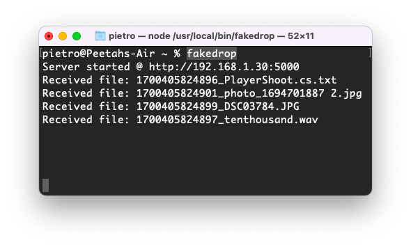
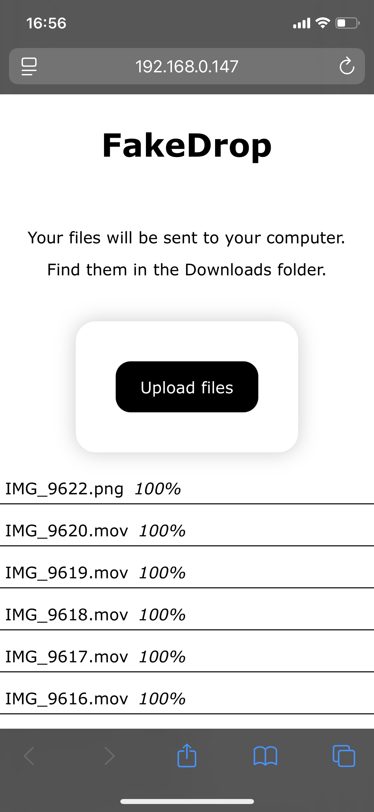

# FakeDrop (express CLI version)

> A "drop-in" cross-platofrm AirDrop alternative.

## What does it do?

FakeDrop allows devices connected to the same network to send files to the host machine.

It works as an Apple AirDrop alternative for cross-platform usage.

Just scan the QR code with your mobile device and send the files from your browser!

## Usage

### Run from Source

- clone the repository
- install the depencies
  > `$ yarn` or `$ npm install`
- build the project
  > `$ yarn build` or `$ npm run build`
- run
  > `$ yarn start:prod` or `$ npm run start:prod`

### Screenshots

What it looks like in the terminal

What it looks like on your phone

## Disclaimer

Code is a little scuffed because I wanted to not make this a react app for once and just use vanilla html/css/js in the frontend.
I have no excuse for the backend lmao I just wanted to make this quick and simple

Enjoy!
